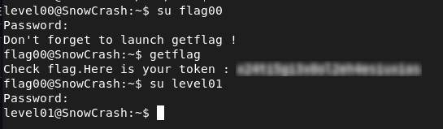

# Level00 – Weak Encoding Exposure

## Description 

I searched for files owned by `flag00`:

```bash
find / -user "flag00" 2>/dev/null
```

This led me to an interesting file: `/usr/sbin/john`.
The content appeared as a string of alphabetic characters, suggesting a simple encoding mechanism rather than strong encryption.

## Exploitation

To decode it, a Caesar cipher was applied using different shifts.
After a few attempts, a readable string was obtained, revealing a password.
This password was then used to retrieve the flag for the level.

## Remediation
- Do not use weak or reversible encoding for sensitive data
- Use proper encryption to protect confidential information

## Conclusion

This issue demonstrates that weak encoding can be easily reversed, exposing sensitive data. Strong cryptographic methods should be used instead.


