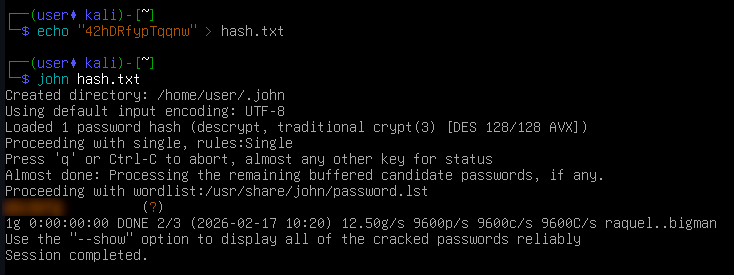
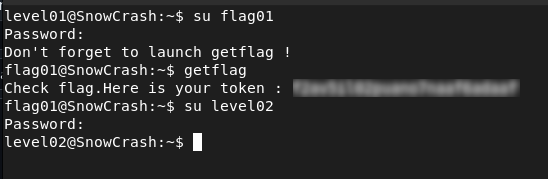

# Level01 - Weak Password Hash Exposure

## Description

I checked the `/etc/passwd` file and found this entry for `flag01`:

```bash
flag01:42hDRfypTqqnw:3001:3001::/home/flag/flag01:/bin/bash
```

The hash `42hDRfypTqqnw` is stored directly in `/etc/passwd`.
Modern systems usually keep hashes in `/etc/shadow` for security.
Its 13-character format indicates a legacy DES-based hash.

## Exploitation

The hash was cracked using **John the Ripper**, which revealed the original password.



## Remediation
- Avoid storing password hashes in publicly readable files like `/etc/passwd`.  
- Use `/etc/shadow` with proper permissions and stronger hashing algorithms.

## Conclusion

This issue demonstrates that storing hashes in accessible locations and using weak algorithms can lead to password compromise.


