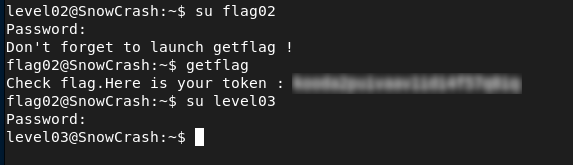

# Level02 - Cleartext Credential Exposure (Telnet)

## Description

While exploring the home directory, I found a packet capture file:

```bash
ls -la
----r--r-- 1 flag02 level02 8302 Aug 30 2015 level02.pcap
```

This file contains network traffic, so I transferred it to my local machine:

```bash
scp -P 4243 level02@10.14.14.4:/home/user/level02/level02.pcap ~/Downloads/
```
## Exploitation

I opened the capture in Wireshark and followed the TCP stream of a Telnet session.
The credentials were transmitted in cleartext.

Some characters, like `0x7f` (ASCII DELETE), were removed to reconstruct the correct password.
This allowed successful recovery of the credentials and access to the next level.

## Remediation
- Avoid using insecure protocols such as Telnet for authentication.  
- Use encrypted alternatives like SSH.

## Conclusion

This issue demonstrates that cleartext transmission of credentials can be intercepted easily. Encrypted protocols should always be used to protect sensitive information.


