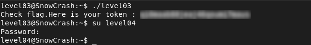

# Level03 - PATH Hijacking in SUID Binary

## Description

The `level03` binary has the SUID bit set and is owned by `flag03`.
Using tools like `strings` and `ltrace`, I found that the program executes the following command:

```bash
/usr/bin/env echo Exploit me
```

This relies on `/usr/bin/env` to locate the `echo` command using the `PATH` environment variable.
Since the path to `echo` is not absolute (e.g., `/bin/echo`), this allows a **PATH hijacking** attack.

## Exploitation
I created a `echo` script in a writable directory:

```bash
#!/bin/sh
/bin/getflag
```

Then, I modified the `PATH` variable to prioritize my directory and executed the binary.
The program ran my malicious `echo` with `flag03` privileges, allowing me to retrieve the flag.

## Remediation
- Always use absolute paths when calling system commands in privileged programs.
- Do not rely on environment variables like `PATH` in SUID binaries.

## Conclusion

This vulnerability shows that relying on environment variables in SUID binaries can allow privilege escalation via PATH hijacking.


