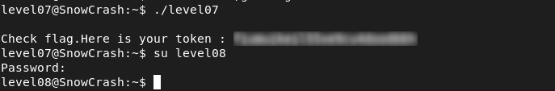

# Level07 - Command Injection via Environment Variable

## Description

The `level07` binary has the SUID bit set and is owned by `flag07`.
Using `ltrace`, I observed the following behavior:

```bash
getenv("LOGNAME") = "level07"
asprintf(...)
system("/bin/echo level07")
```

The program reads the `LOGNAME` environment variable, builds a command with `asprintf`, and executes it using `system()`.
Since `system()` runs a shell (`/bin/sh -c`), any user-controlled input included in the command can lead to command injection.
Because the binary runs with SUID privileges, injected commands are executed as `flag07`.

## Exploitation

The `LOGNAME` variable was modified with a payload:

```bash
export LOGNAME=';getflag'
```
Then the binary was executed.
The injected command was interpreted by the shell, allowing `getflag` to run with elevated privileges.

## Remediation
- Avoid using environment variables in command construction within privileged programs.
- Do not use `system()` with untrusted input

## Conclusion

This vulnerability demonstrates that using environment variables in command execution can lead to command injection and privilege escalation.


