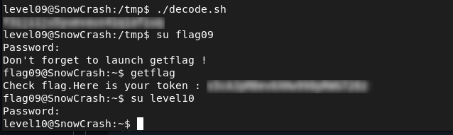

# Level09 - Reversing a Positional Encoding Algorithm

## Description

While analyzing the `level09` binary and the provided `token` file, I observed that the program changes each character of the input based on its position in the string by testing the binary with controlled inputs:

```bash
encrypted_char = original_char + index
```
The token file has unreadable bytes, which shows the same method was used.

## Exploitation

Since the encoding is simple, it can be reversed:

```bash
original_char = encrypted_char - index
```
To work with the `token`, I first converted it to hexadecimal using `xxd`:

```bash
xxd token
0000000: 6634 6b6d 6d36 707c 3d82 7f70 826e 8382  f4kmm6p|=..p.n..
0000010: 4442 8344 757b 7f8c 890a                 DB.Du{....
```
A simple script reversed the encoding byte by byte:

```bash
#!/bin/bash

i=0
token="66 34 6b 6d 6d 36 70 7c 3d 82 7f 70 82 6e 83 82 44 42 83 44 75 7b 7f 8c 89"

for byte in $token
do
    dec=$((16#$byte))
    orig=$(( (dec - i) % 256 ))
    printf "\\$(printf '%03o' "$orig")"
    ((i++))
done
echo
```

## Remediation
- Do not use simple encoding methods for sensitive data.
- Use strong, standard encryption instead.

## Conclusion

This example shows that simplistic encoding schemes can be easily reversed, exposing sensitive information.


