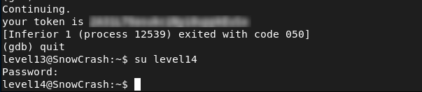

# Level13 - UID Check Bypass via Debugging

##  Description

The `level13` binary is a SUID 32-bit executable.
Using `ltrace`, I identified a check based on the user ID:

```bash
getuid() = 2013
UID 2013 started us but we expect 4242
```
The program exits if the current UID is not `4242`.

## Exploitation

This check can be bypassed by modifying the return value of `getuid()` during execution.
Using `gdb`, the function was intercepted and altered:
```bash
gdb ./level13
break getuid
run
finish
set $eax = 4242
continue
```
After this, the program thinks it is running with UID `4242` and continues to reveal the flag.

## Remediation
- Do not rely only on `getuid()` for access control
- Consider anti-debugging measures for sensitive binaries

## Conclusion

This vulnerability demonstrates that client-side or runtime checks can be bypassed through debugging, leading to unauthorized access.


