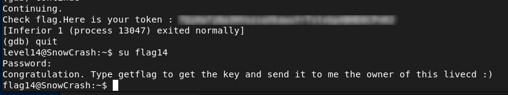

# Level14 - Anti-Debugging and UID Check Bypass

## Description

The `/bin/getflag` binary is a 32-bit ELF SUID executable with anti-debugging and UID checks.

Using `ltrace` and disassembly, I identified two main protections:

- A call to `ptrace()` used to detect debugging attempts
- A call to `getuid()` followed by UID validation
- 
If either check fails, the program exits.

## Exploitation

To bypass these protections, I used `gdb` to bypass both protections by changing the return values at runtime:

```bash
gdb /bin/getflag
```

I set breakpoints on both `ptrace` and `getuid`:

```bash
break ptrace
break getuid
run
```

To bypass the anti-debugging check, I forced `ptrace()` to return `0`:

```bash
finish
set $eax = 0
continue
```

Then, to bypass the UID check, I modified the return value of `getuid()` to match the expected UID:

```bash
finish
set $eax = 3014
continue
```
After these changes, the binary runs normally and prints the flag.

## Remediation
- Do not rely only on `ptrace()` to block debugging
- Avoid using `getuid()` alone for access control in SUID programs

## Conclusion

This vulnerability demonstrates that runtime protections like anti-debugging and UID checks can be bypassed using debugging tools, leading to unauthorized access.


